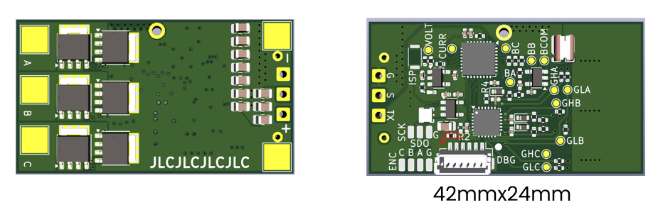

# NXP AM32 ESC based on MCXA153/MCXA133

MR-ESC-MCXA-AM32 is a proof of concept Drone motor ESC (Electronic Speed Controller) motor controller, 
using NXP MCXA153/MCXA133 MCU and running the open-source AM32 software.

> [!IMPORTANT]
> This design is not supported by NXP motor control framework tools (it could of course be made to run with modifications)

> [!NOTE]
> AM32 fork with MCXA153/MCXA133 support: [AM32 MCXA153/MCXA133 firmware](https://github.com/NXPHoverGames/AM32/tree/main_am32_mcxa).
> Build target for MCXA153 is "FRDM_A153".
> 
> Design files are made with KiCAD.

<h1><strong>More pictures</strong></h1>

