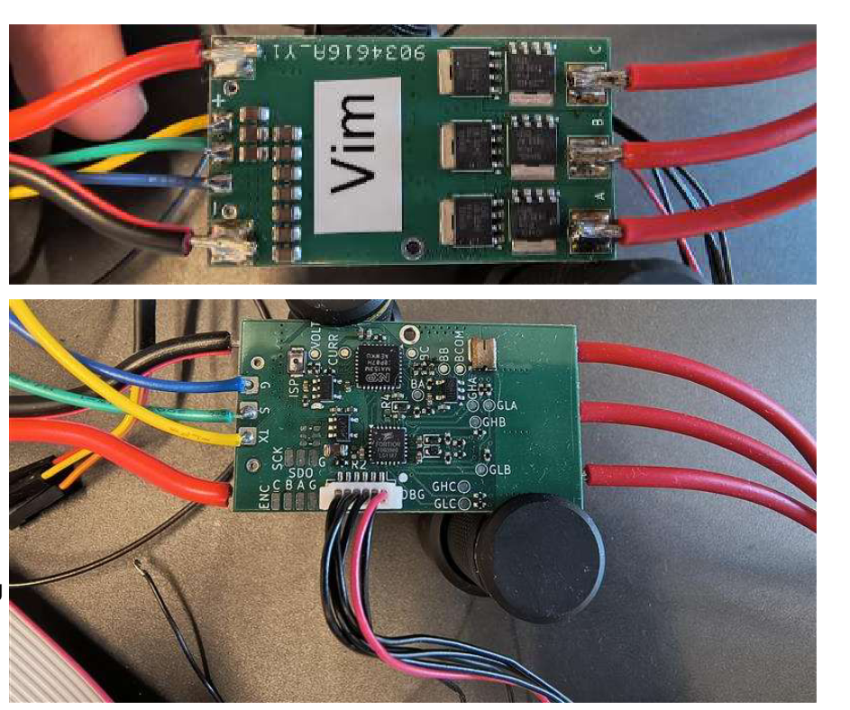

MR-ESC-MCXA-AM32 is a proof of concept Drone motor ESC (Electronic Speed Controller) motor controller, 
using NXP MCXA153 MCU and running the opensource AM32 software.

NOTE: This design is not supported by NXP motor control framework tools 
(it could of course be made to run with modifications)

Design files are made with KiCAD.

AM32 fork with MCXA153 support: [AM32 MCXA153 firmware](https://github.com/NXPHoverGames/AM32/tree/main_am32_mcxa).
Build target for MCXA153 is "FRDM_A153".

