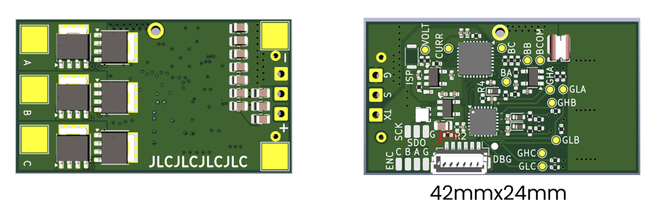

# NXP AM32 ESC based on MCXA153/MCXA133

MR-ESC-MCXA-AM32 is a proof of concept Drone motor ESC (Electronic Speed Controller) motor controller, 
using NXP MCXA153/MCXA133 MCU and running the open-source AM32 software.
A limited number of prototype hardware samples may be available, please contact your local NXP representative. 

> [!NOTE]
> AM32 fork with MCXA153/MCXA133 support: [AM32 MCXA153/MCXA133 application](https://github.com/NXPHoverGames/AM32/tree/main_am32_mcxa) and [AM32 MCXA153/MCXA133 bootloader](https://github.com/NXP-Robotics/AM32-bootloader/tree/main_mcxa).
> Build target for MCXA153/MCXA133 in main application is "FRDM_A153" and "AM32_A153_BOOTLOADER_P1_2" in bootloader.
>
> Hex files can be downloaded from the official AM32 configurator: [AM32 configurator downloads](https://am32.ca/downloads)            
> AM32 Motor Control Application: AM32_FRDM_A153_2.20.hex; AM32 Bootloader: AM32_A153_BOOTLOADER_PB2_V17.hex
>
> Flash board using the 6-pin JST-SH connector ([Pixhawk Debug Mini](https://docs.px4.io/main/en/debug/swd_debug#pixhawk-debug-mini))
> 
> Design files are made with KiCAD.

> [!IMPORTANT]
This design is not supported by NXP motor control framework tools (it could of course be made to run with modifications)

<h1><strong>More pictures</strong></h1>

