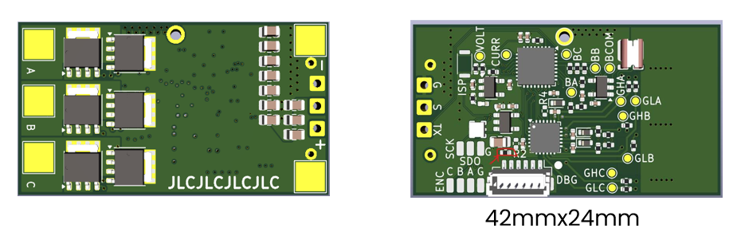
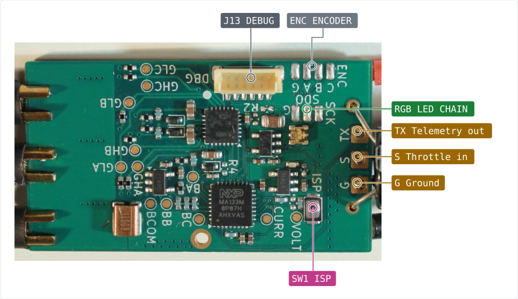
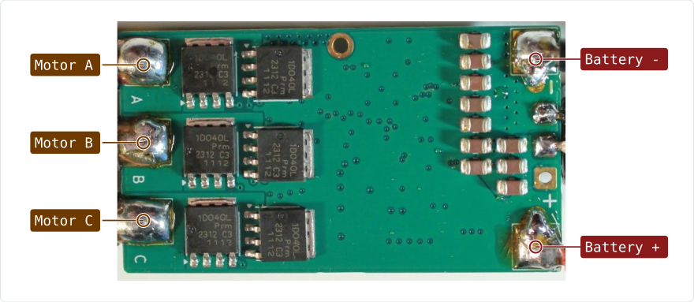
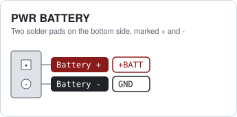
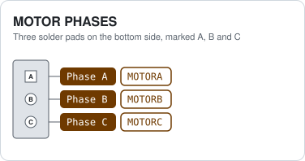
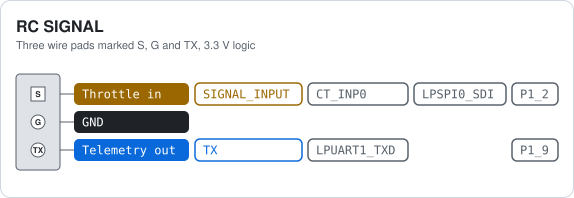
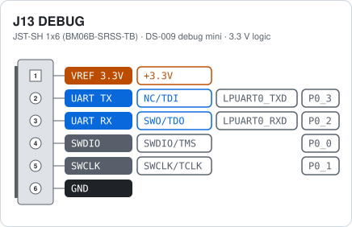
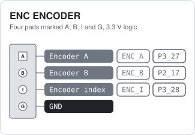
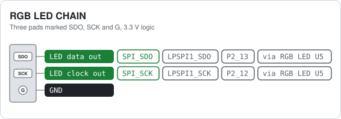

# NXP AM32 ESC based on MCXA153/MCXA133

MR-ESC-MCXA-AM32 is a proof of concept Drone motor ESC (Electronic Speed Controller) motor controller, 
using NXP MCXA153/MCXA133 MCU and running the open-source AM32 software.
A limited number of prototype hardware samples may be available, please contact your local NXP representative. 

> [!NOTE]
> AM32 fork with MCXA153/MCXA133 support: [AM32 MCXA153/MCXA133 application](https://github.com/NXPHoverGames/AM32/tree/main_am32_mcxa) and [AM32 MCXA153/MCXA133 bootloader](https://github.com/NXP-Robotics/AM32-bootloader/tree/main_mcxa).
> Build target for MCXA153/MCXA133 in main application is "FRDM_A153" and "AM32_A153_BOOTLOADER_P1_2" in bootloader.
>
> Hex files can be downloaded from the official AM32 configurator: [AM32 configurator downloads](https://am32.ca/downloads)            
> AM32 Motor Control Application: AM32_FRDM_A153_2.20.hex; AM32 Bootloader: AM32_A153_BOOTLOADER_PB2_V17.hex
>
> Flash board using the 6-pin JST-SH connector ([Pixhawk Debug Mini](https://docs.px4.io/main/en/debug/swd_debug#pixhawk-debug-mini))
> 
> Design files are made with KiCAD.

> [!IMPORTANT]
This design is not supported by NXP motor control framework tools (it could of course be made to run with modifications)

<h1><strong>More pictures</strong></h1>

## Board overview

All pin data below comes from the KiCad design files in this repository.

Each card shows, per pin, the **function**, the **net name in the schematic** and the **MCU pad**
the signal ends up on. Most connections are solder pads; the only connector is the debug port.

<!-- overview:top -->
<picture>
  <source media="(prefers-color-scheme: dark)" srcset="images/overview-top-dark.svg">
  
</picture>
<!-- /overview -->

<!-- overview-list:top -->
Not visible here: [PWR BATTERY](#esc-pwr-battery) (bottom view) · [MOTOR PHASES](#esc-motor-phases) (bottom view)
<!-- /overview-list -->

Bottom side, with the battery and motor pads:

<!-- overview:bottom -->
<picture>
  <source media="(prefers-color-scheme: dark)" srcset="images/overview-bottom-dark.svg">
  
</picture>
<!-- /overview -->

## Connector index

<!-- index -->
| Ref | Function | Connector | Details |
|---|---|---|---|
| [ESC ENC](#esc-enc-encoder) ENCODER | Spare MCU pins for a quadrature encoder, solder pads | Four pads marked A, B, I and G, 3.3 V logic |  |
| [ESC MOTOR](#esc-motor-phases) PHASES | Three motor phase outputs | Three solder pads on the bottom side, marked A, B and C |  |
| [ESC PWR](#esc-pwr-battery) BATTERY | Battery input, 6 to 24 V (2S to 6S LiPo) | Two solder pads on the bottom side, marked + and - |  |
| [ESC RC](#esc-rc-signal) SIGNAL | Throttle input and telemetry output, solder pads | Three wire pads marked S, G and TX, 3.3 V logic |  |
| [ESC RGB](#esc-rgb-led-chain) LED CHAIN | Output of the on-board RGB LED chain, solder pads | Three pads marked SDO, SCK and G, 3.3 V logic |  |
| [ESC J13](#esc-j13-debug) DEBUG | SWD debug and console (DS-009 debug mini) | JST-SH 1x6 (BM06B-SRSS-TB) |  |
<!-- /index -->

## Power and motor

<!-- heading:main/PWR -->
### ESC PWR BATTERY
<!-- /heading -->

<!-- pinout:main/PWR -->
<picture>
  <source media="(prefers-color-scheme: dark)" srcset="images/main-PWR-dark.svg">
  
</picture>

Solder the battery leads here. Input range is 6 to 24 V, so 2S to 6S LiPo. The 5 V and 3.3 V rails come from two TPS7B92 linear regulators on this input; below about 6 V the 5 V rail drops out. All parts on the battery rail are rated 35 V or more (capacitors 35 V, regulators 40 V, FETs 80 V), which leaves margin for a full 6S pack at 25.2 V. Keep the 470 µF capacitor across the pads when you use long battery leads.

> [!CAUTION]
> There is no reverse polarity protection. Check + and - before you connect a battery.
<!-- /pinout -->

<!-- heading:main/MOTOR -->
### ESC MOTOR PHASES
<!-- /heading -->

<!-- pinout:main/MOTOR -->
<picture>
  <source media="(prefers-color-scheme: dark)" srcset="images/main-MOTOR-dark.svg">
  
</picture>

Each phase is a half bridge of two PSMN3R3-80 FETs (80 V), driven by the gate driver U2. Swap any two phases to reverse the motor direction. The phase voltages also feed the back-EMF comparators of the MCU, which is how the ESC senses the rotor position.
<!-- /pinout -->

## Control

<!-- heading:main/RC -->
### ESC RC SIGNAL
<!-- /heading -->

<!-- pinout:main/RC -->
<picture>
  <source media="(prefers-color-scheme: dark)" srcset="images/main-RC-dark.svg">
  
</picture>

S is the throttle signal from the flight controller. The AM32 port for this MCU detects the input type by itself and supports DShot300, DShot600 (both also as bidirectional DShot) and normal servo PWM (1 to 2 ms, up to 400 Hz). DShot150 and other protocols are not supported. AM32 reads the signal with a CTIMER0 capture input and, for bidirectional DShot, switches the same pin to LPSPI0 to send the RPM telemetry back on the signal wire. TX is the AM32 serial telemetry output on LPUART1, 115200 baud, for a flight controller ESC telemetry input.

> [!NOTE]
> The signal input is 3.3 V logic. Do not connect it to a 5 V PWM source without a level shifter.
<!-- /pinout -->

<!-- heading:main/J13 -->
### ESC J13 DEBUG
<!-- /heading -->

<!-- pinout:main/J13 -->
<picture>
  <source media="(prefers-color-scheme: dark)" srcset="images/main-J13-dark.svg">
  
</picture>

Flash and debug the MCU over SWD with any probe that supports the DS-009 debug mini cable. Pins 2 and 3 are LPUART0 on the MCU, free for a console; AM32 sends its telemetry on LPUART1 (the TX pad) instead. Pin 1 is a 3.3 V reference output for the probe.

> [!WARNING]
> Pin 1 is a reference output, not a supply input. Never power the board from it.
<!-- /pinout -->

## Expansion pads

<!-- heading:main/ENC -->
### ESC ENC ENCODER
<!-- /heading -->

<!-- pinout:main/ENC -->
<picture>
  <source media="(prefers-color-scheme: dark)" srcset="images/main-ENC-dark.svg">
  
</picture>

Prepared for an encoder on wheeled robots, where the ESC needs odometry. The AM32 firmware does not use them yet; it only drives A and I as debug outputs. Nothing else on the board is connected to these pins.
<!-- /pinout -->

<!-- heading:main/RGB -->
### ESC RGB LED CHAIN
<!-- /heading -->

<!-- pinout:main/RGB -->
<picture>
  <source media="(prefers-color-scheme: dark)" srcset="images/main-RGB-dark.svg">
  
</picture>

The MCU drives one APA102-type RGB LED (U5) on LPSPI1. These pads are the data and clock outputs of that LED, so more LEDs of the same type can be chained from here.
<!-- /pinout -->

## Test pads

Thirteen round pads on the top side, named on the silkscreen. They are probe points for a scope
or meter, not for wires.

| Pad | Net | MCU pin | What you see there |
|---|---|---|---|
| GHA, GHB, GHC | GHA, GHB, GHC | P3_1, P3_9, P3_11 drive them | Gate of the high side FET of phase A, B, C. Output of the gate driver U2. |
| GLA, GLB, GLC | GLA, GLB, GLC | P3_0, P3_8, P3_10 drive them | Gate of the low side FET of phase A, B, C. Output of the gate driver U2. |
| BA, BB, BC | BEMFA, BEMFB, BEMFC | P1_0, P1_1, P1_3 | Back-EMF of phase A, B, C, scaled down by a divider. The MCU comparator uses these to find the rotor position. |
| BCOM | BEMF_COMMON | P2_2, P2_3 | Virtual star point: the three phase dividers joined. Reference for the back-EMF comparator. |
| VOLT | VOLTSENSE | P2_16 (ADC0 channel 6) | Battery voltage, scaled down by a divider. |
| CURR | CURRENT | P2_7 (ADC0 channel 7) | Output of the INA180 current amplifier: motor current as a voltage. |
| GND | GND |  | Ground for the probe. |

## Buttons and switches

<!-- switches -->
| Ref | Board | Function | Type | Notes |
|---|---|---|---|---|
| SW1 ISP | ESC | ISP boot button | Tactile switch | Hold it while power comes up to start the MCU boot ROM in ISP mode (P3_29 pulled low). Normal boot otherwise. |
<!-- /switches -->

## AM32 firmware

The board runs the open AM32 firmware. The firmware fork for this MCU, the hex files and how to
flash them are in the
[MR-ESC-MCXA-AM32 README](https://github.com/NXP-Robotics/MR-ESC-MCXA-AM32#readme).

Settings are changed with the [AM32 web configurator](https://am32.ca) over the signal wire,
pad S. Connect it either through the flight controller (Betaflight passthrough) or with a
serial link to a PC. No extra connector is needed. The input protocols the firmware accepts are
listed on the [RC SIGNAL card](#esc-rc-signal).

Useful pages on the AM32 wiki:

- [ESC settings explained](https://wiki.am32.ca/guides/ESC-Settings-Explained.html): what every setting does.
- [Recommended settings for freestyle drones](https://wiki.am32.ca/general/Recommended-Settings-For-Freestyle.html).
- [Flashing a single ESC](https://wiki.am32.ca/guides/AM32--single-ESC-Flashing-Tutorial.html).
- [PC link with an Arduino](https://wiki.am32.ca/guides/Arduino-PC-Link.html): a serial link to the signal wire without a flight controller.
- [Hardware design notes](https://wiki.am32.ca/development/Hardware-Design.html): for changes to the board design.
- [EEPROM format](https://wiki.am32.ca/development/Open-ESC-EEPROM-Format.html): where the settings live in flash.

> [!TIP]
> AM32 beeps through the motor at power up and after a settings change. Connect a motor before you look for the beep codes.

## Notes

- The debug port follows the Dronecode
  [DS-009 connector standard](https://github.com/pixhawk/Pixhawk-Standards/blob/master/DS-009%20Pixhawk%20Connector%20Standard.pdf)
  (debug mini), so a standard 6-pin debug cable fits.

> [!WARNING]
> The board has no reverse polarity protection and no input fuse. Wrong polarity on the battery pads destroys it.

## Downloads

This reference as an [A4 PDF](MR-ESC-MCXA-AM32-hardware-reference.pdf), and all cards on one
A4 landscape sheet: [cheat sheet PDF](MR-ESC-MCXA-AM32-cheatsheet.pdf).

NXP and the NXP logo are registered trademarks of NXP B.V. This document is maintained by the
community and is not an official NXP publication.
